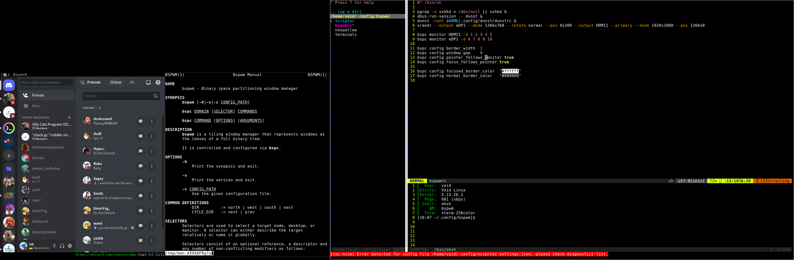

# Dotfiles
My config files for my minimal bspwm/void desktop 

  

### Software
- Alacritty
- Qutebrowser
- Neo-vim
- oksh
- doas
- Sxhkd
- mpv
- mupdf
- lf
- scrot
  - Image viewer: https://github.com/cirala/lfimg
- nsxiv
### Scripts
- https://github.com/lobruh/scripts

